# PrivateWorkshop  
A complete **Workshop Booking & Management System** built with **ASP.NET Core MVC (.NET 9)**, featuring full CRUD, role-based access control, and advanced booking management for both clients and administrators.

---

## 🧾 Project Summary  
PrivateWorkshop simulates a production-grade workshop reservation platform used by both **clients** and **administrators**. The project demonstrates key backend, frontend, and architectural skills including:

- **Authentication with ASP.NET Identity**
- **Role-based authorization**
- **Session timeout handling**
- **Repository pattern for data access**
- **Unit testing with xUnit**
- **Search, filtering, sorting, and pagination**

This application was designed as a full-stack, real-world MVC project showcasing clean architecture and .NET development best practices.

---

## ✨ Features  

### 👤 Authentication & Authorization  
- Register / Login / Logout with **ASP.NET Core Identity**  
- Role-based access (Admin / Client)  
- Auto-assign default role on registration  
- **Login session timeout** with sliding expiration  

### 🧑‍🏫 Workshop Management  
- Admin can **Create**, **Edit**, **Delete** workshops  
- **Manage booking status** directly from workshop dashboard  
- Display workshop detail and available slots  
- Validate slot capacity when booking  

### 📝 Booking System  
- Clients can **enroll** in workshops  
- Clients can **cancel** their bookings  
- Admin can **approve / reject / delete** bookings  
- View booking history with real-time status updates  

### 📄 Booking List Enhancements  
- **Sorting** (Created Date, Workshop Date)  
- **Filtering** by Booking Status  
- **Searching** by Workshop Name or Participant Email  
- **Pagination** for large datasets

---

## 🧪 Unit Testing  
The solution includes a dedicated **Unit Test Project** using **xUnit** to validate Repository functionality.

### ✔ Test Highlights  
- In-memory EF Core testing with `UseInMemoryDatabase`  
- Test coverage for:  
  - Creating bookings  
  - Fetching records  
  - Basic repository CRUD behavior  
- Fully isolated, repeatable tests
  
---

## 🧰 Technologies  
- **ASP.NET Core MVC (.NET 9)**  
- **Entity Framework Core**  
- **ASP.NET Identity (Cookie Authentication)**  
- **SQL Server**  
- **Bootstrap 5**  
- **Repository Pattern**  

---

## 🎯 Highlights  
- Clean, layered **MVC + Repository** architecture  
- Full CRUD and data validation workflow  
- Session expiration with sliding renewal  
- Seamless UI with search + filter + sort + pagination  
- Demonstrates real-world **role-based authorization** in .NET  
- Includes **unit-tested** repository layer for reliability
  
---

## 📸 Application Screenshots

Below is a visual overview of core system functionality.

---

### 1. Guest Experience
#### Home Page (Guest)
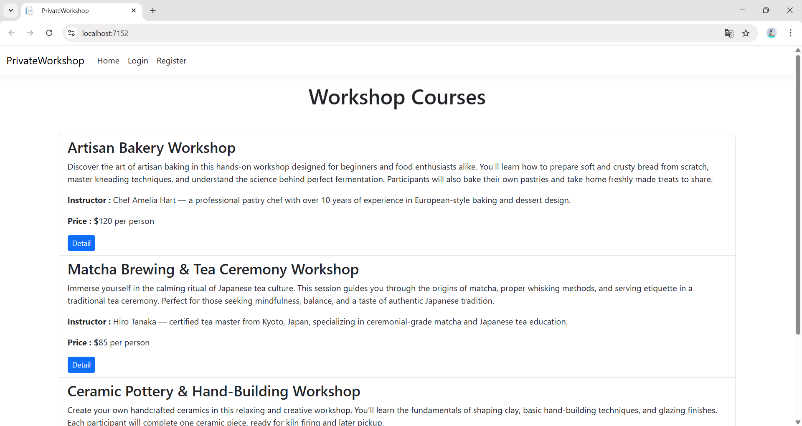

---

### 2. Client Experience
#### Home Page (Client)
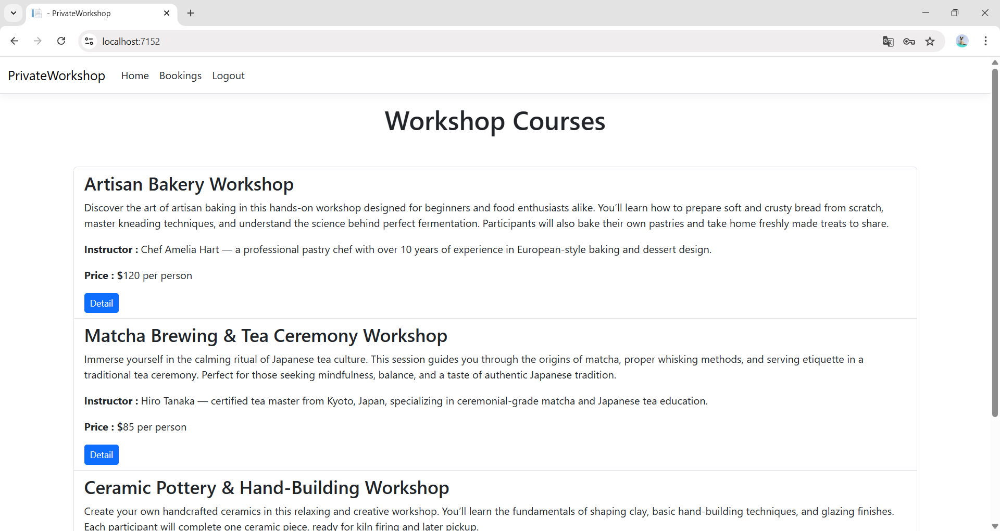

#### Workshop Detail & Enrollment
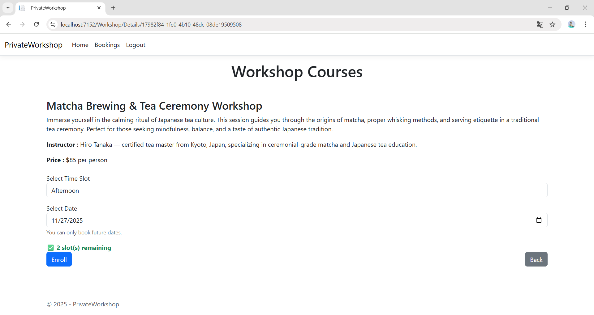

---

### 3. Admin Experience
#### Admin Dashboard
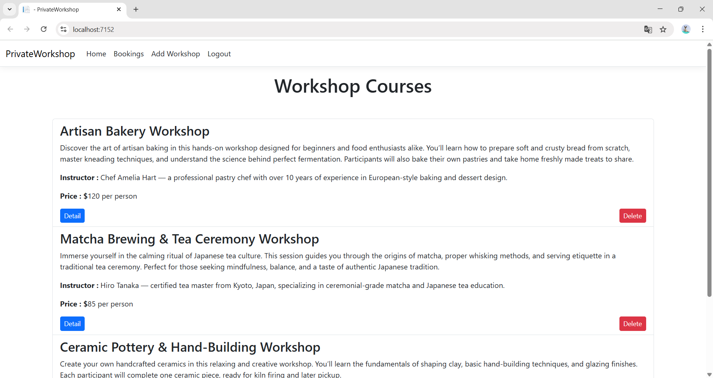

#### Add Workshop
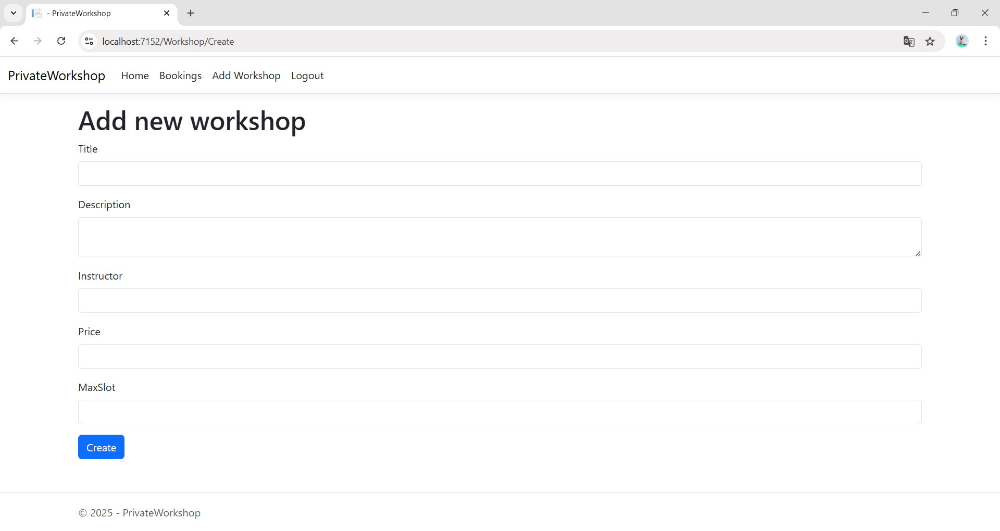

---

### 4. Booking Management (Admin)
#### Sort Feature
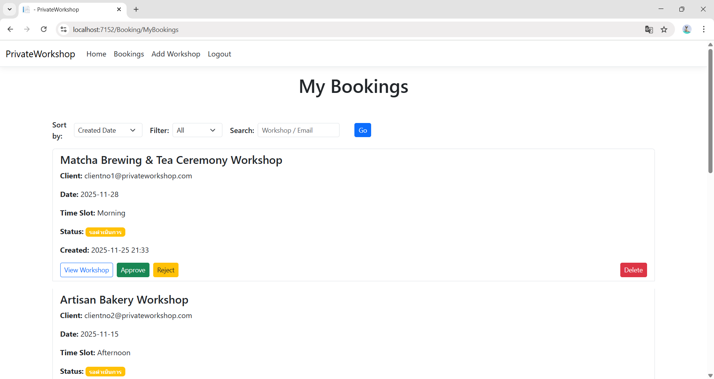

#### Filter Feature
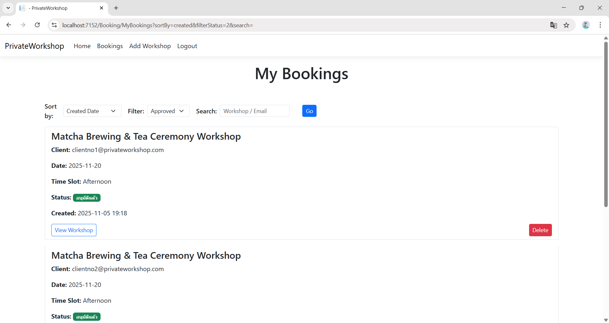

#### Search Feature
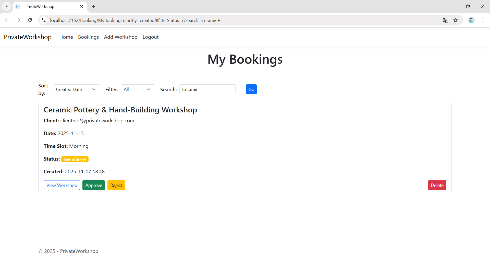

#### Pagination Feature

---

### 5. Authentication
#### Login Page
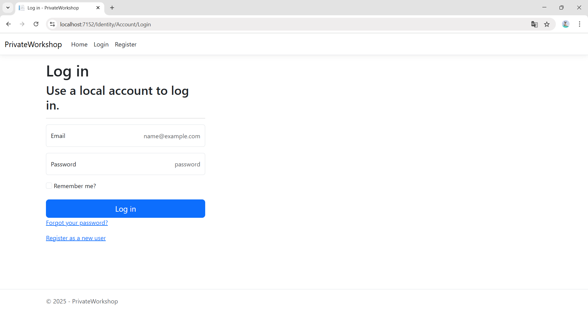

#### Registration Page
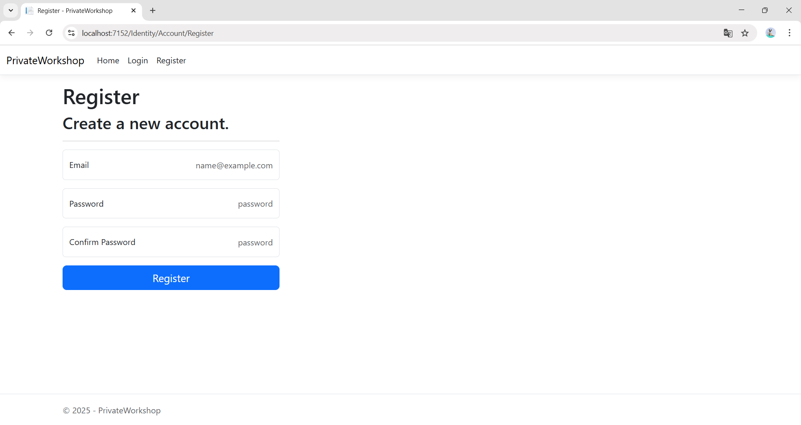

#### Logout Page
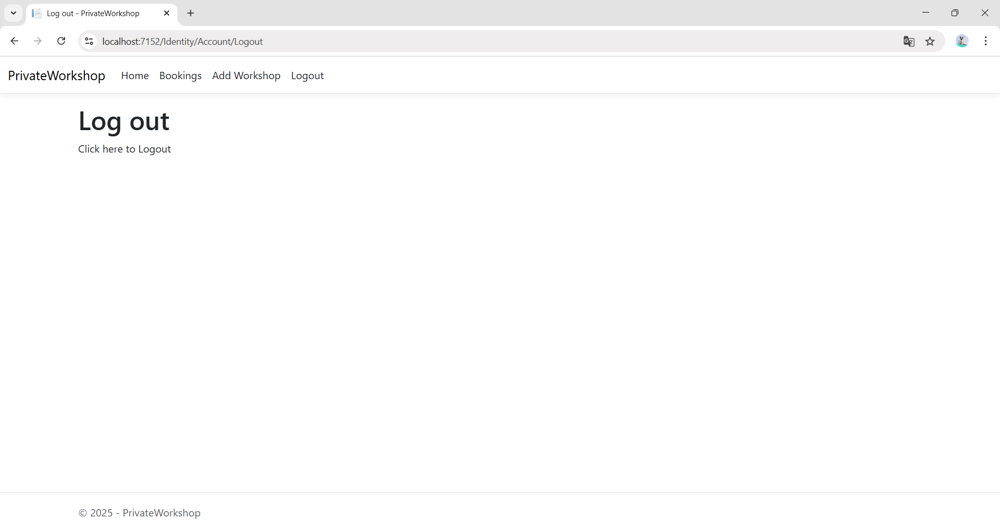

---

## 🚀 How to Run  
1. Update your SQL Server connection string  
2. Run database migrations  
3. Launch the application  
4. Default roles will auto-generate (Admin / Client)

---

## 🧑‍💻 Author  
**Aujchara Deeunkong**  
Open to opportunities in **.NET Backend Engineering**  
🔗 LinkedIn: www.linkedin.com/in/acrdehour-592789391
📧 Email: acrdehour@gmail.com
